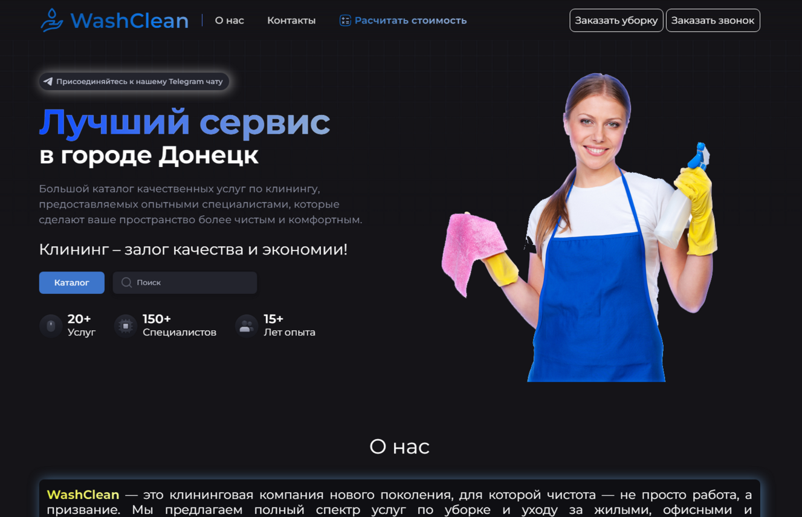
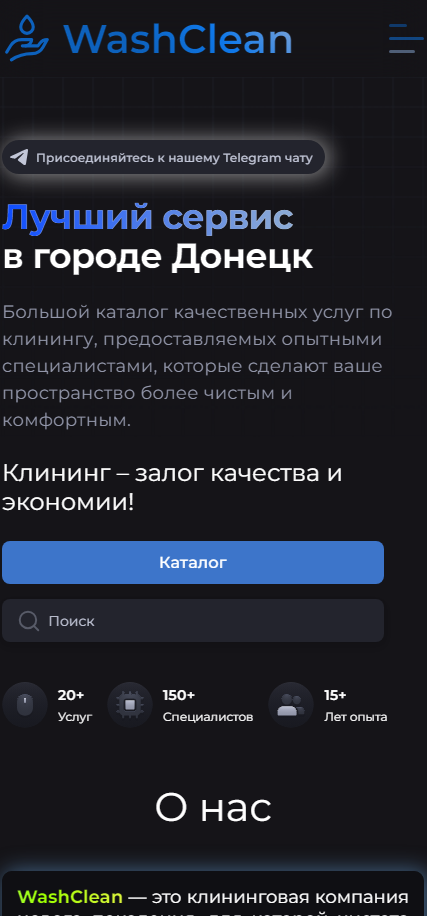

# Cleaner Company  

<p align="center">

</p>


   <h1>WashClean</h1>  это современный веб-сайт для клининговой компании, предоставляющий удобный интерфейс для клиентов, информацию о предоставляемых услугах и возможность быстрого заказа.


## 🌟 Основные возможности  
- **Информация об услугах:** Полный перечень доступных клининговых услуг.  
- **Калькулятор услуг:** Удобный инструмент для расчета стоимости услуг в режиме онлайн.  
- **Контактные данные:** Легкий доступ к контактам и формам обратной связи.  
- **Адаптивный дизайн:** Отличный внешний вид на любом устройстве (мобильные, планшеты, ПК).  
- **Отзывы:** Секция с реальными отзывами клиентов.  
- **Интерактивный заказ:** Форма для быстрого заказа услуг.  

---  


## 📂 Структура проекта  
```
cleanerCompany/
├── index.html         # Главная страница
├── styles.css         # Стили проекта
├── script.js          # Скрипты для функциональности
├── img/               # Изображения, иконки и другие медиафайлы
└── README.md          # Описание проекта
```  

## 🚀 Запуск  

1. ## <a href="https://teamliderccmp.github.io/cleanerCompany/" target="_blank">Перейти на сайт</a>

   

## 🛠 Технологии  
- **HTML5:** Разметка страницы.  
- **CSS3:** Стилизация и адаптивность.  
- **JavaScript:** Интерактивные элементы.  

## 🎨 Скриншоты  
<div style="display: flex; justify-content: center; gap: 20px;">
    <h1 align="center"> 🖥️ Главный экран </h1>
  <p align="center">
   
     </p>
   <h1 align="center"> 📱 Мобильная версия </h1>
   <p align="center"> 
  
      </p>
</div>

## 💡 Идеи для улучшений  
- Добавить возможность онлайн-оплаты.  
- Реализовать личный кабинет клиента.  
- Интеграция с Google Maps для отображения зоны обслуживания.  

## 📞 Контакты  
Если у вас есть вопросы или предложения, свяжитесь с нами:  
- **Email:** cleanercompany@example.com  
- **Телефон:** +7 (123) 456-7890  

---
